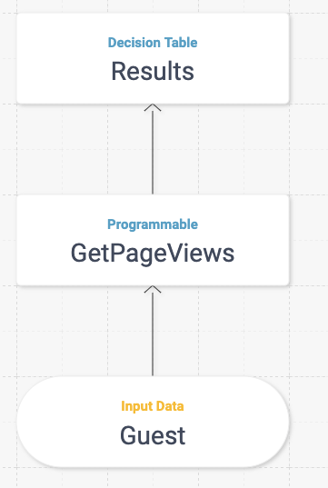
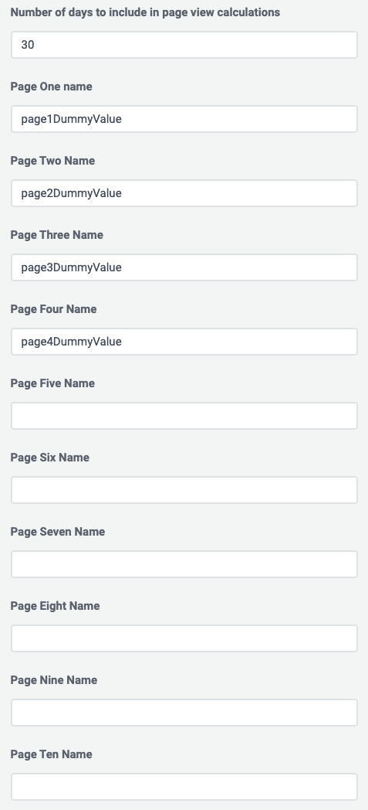
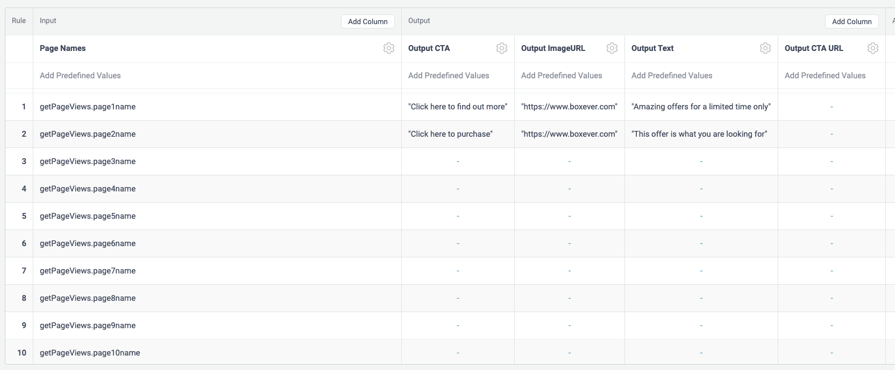

# Most Viewed Page Decision Model Blueprint

This decision model will get the most viewed page from your customers sessions and return relevant content for you to display.

## How to use
Once you have created a decision model and variant - [Boxever Docs](https://documentation.boxever.com/docs/managing-decision-models) - you can then upload the above XML configuration which will present you with the following canvas.

You can then edit the GetPageViews programmable and will be presented with the following form. From here you must first enter the amount of days you would like the calculations to look back on to find the most viewed page, after this then you can enter up to 10 pages to check. The page name must match the "page" value sent in a [VIEW](https://developer.boxever.com/docs/sending-your-first-event) event 

Finally you can then edit the output columns to include the relevant content you would like to see returned for each page. The input columns will dynamically take your page names from the form so no need to include again

