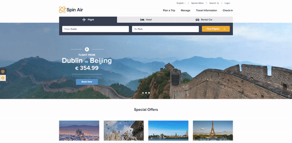

# Email Capture Corner Pop Up
A pop up that appears in the corner of your site to allow for email capture.

## Quickstart
Copy the HTML/JS/CSS as needed from here to a new [Web Experience](https://documentation.boxever.com/docs/using-custom-code) in Boxever. Once created the following will be configurable components within the experience:
- Position
- Background Colour
- Title Text
- CTA Colour
- Font
- Text Colour
- Body Text
- Button Text
- Button Text Colour
- Privacy Link
- Form Ghost Text
- Privacy Text
- Thank You Title Text
- Thank You Description Text