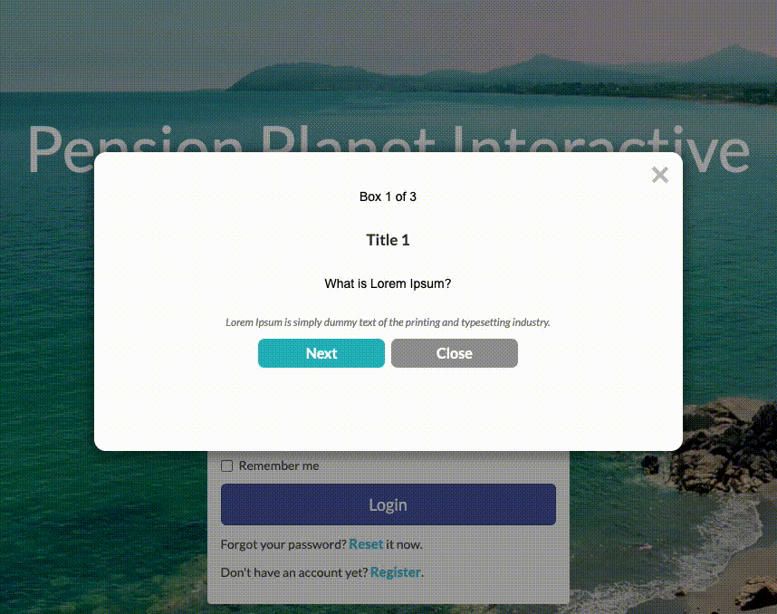

# multiple-page-popup
This is a multiple-page popup.

## Quickstart
Copy the HTML/JS/CSS as needed from here to a new [Web Experience](https://documentation.boxever.com/docs/using-custom-code) in Boxever. Once created the following will be configurable components within the experience:
- Title Text 1
- Header Text 1
- Description Text 1
- Title Text 2
- Header Text 2
- Description Text 2
- Title Text 3
- Header Text 3
- Description Text 3