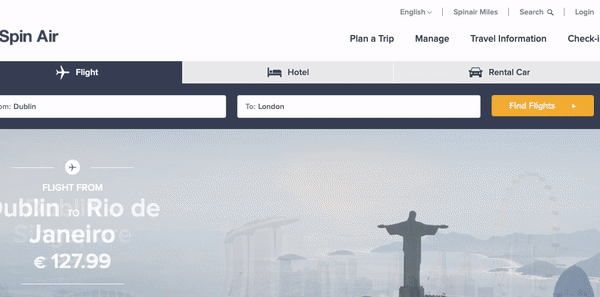

# Pop Up Takeover
A Pop Up message which takes over the screen until clicked.

## Quickstart
Copy the HTML/JS/CSS as needed from here to a new [Web Experience](https://documentation.boxever.com/docs/using-custom-code) in Sitecore CDP. Once created the following will be configurable components within the experience:
- Popup Title
- Description Text
- Button Title
